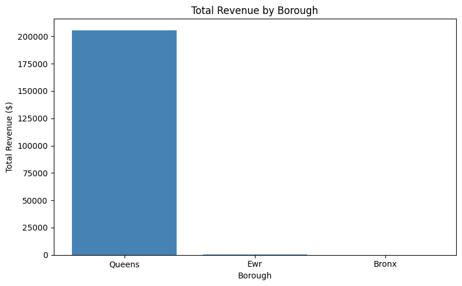
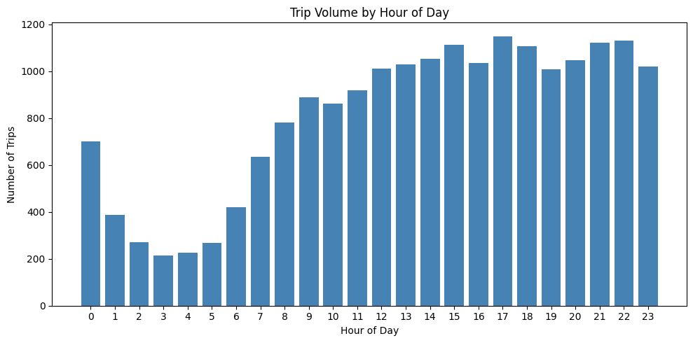

# NYC Taxi Trip Revenue & Operations Analysis
**Python | Pandas | Matplotlib | Data Wrangling | Exploratory Data Analysis**

---

## Executive Summary

This project analyses 19,996 NYC taxi trips to identify revenue patterns, peak demand periods, and operational insights for a ride-hailing fleet. By combining trip data with a geographic zone lookup, the analysis enriches raw transaction records with location context to surface actionable findings for fleet managers and operations teams.

Key finding: **trip volume peaks consistently between 3pm and 6pm, with a secondary morning peak from 7am to 9am**. Trips with tolls generate significantly higher average fares than non-toll trips, indicating that cross-borough and airport routes are the most valuable per trip. Queens-based zones, particularly airport pickups, account for the majority of total revenue in the matched dataset.

**Recommended next steps for a fleet operations team:**
- Prioritise driver availability during the 3pm to 6pm evening peak, where trip volume is highest
- Incentivise airport and cross-borough routes, which generate above-average revenue per trip
- Investigate late-night demand (11pm to 1am) which shows a secondary volume peak worth targeting

---

## Business Problem

Taxi and ride-hailing operators need to understand where and when revenue is generated in order to allocate drivers efficiently and maximise fleet productivity. Raw trip data alone is not enough, it needs to be cleaned, enriched with geographic context, and aggregated to reveal actionable patterns.

> *Which pickup zones and time windows drive the most revenue, and how can fleet operations be optimised to capitalise on these patterns?*

**Primary stakeholder:** Fleet operations managers and revenue analysts at a taxi or ride-hailing platform who need data-driven guidance on driver scheduling and zone prioritisation.

---

## Methodology

**Datasets used:**
- `taxi_trips.csv` — 19,996 trips with fare, tip, toll, distance, passenger count, and location ID data
- `zones.json` — Zone lookup table mapping location IDs to zone names and boroughs

**Approach:**
1. Loaded and inspected both datasets, checking for missing values and data types
2. Converted all numeric columns from string to float using `pd.to_numeric()` with error coercion
3. Cleaned data by removing rows with missing, zero, or negative `total_amount` and `trip_distance`
4. Parsed `pickup_datetime` and extracted hour, day of week, and month features
5. Normalised the JSON zones file using `pd.json_normalize()` and standardised borough casing
6. Merged trip data with zone lookup on pickup location ID using an inner join
7. Aggregated revenue and trip counts by zone and borough
8. Analysed trip volume by hour of day to identify peak demand periods
9. Compared average fares between toll and non-toll trips
10. Calculated tip rate as a percentage of fare across the dataset

---

## Skills

**Python & Libraries:**
- `pandas` — data loading, cleaning, type conversion, GroupBy aggregations, merging, DateTime parsing
- `json` — loading and normalising JSON data with `pd.json_normalize()`
- `matplotlib` — bar chart visualisation and figure export

**Techniques:**
- Multi-column type conversion with `pd.to_numeric()` and error coercion
- DateTime feature engineering (`dt.hour`, `dt.day_name()`, `dt.month`)
- Inner join merging of CSV and JSON datasets on mismatched key names
- String standardisation with `.str.title()` to resolve casing inconsistencies
- GroupBy aggregations (`count`, `mean`, `sum`) with `.agg()`
- Derived column creation (tip rate as a percentage of fare)
- Data filtering for toll vs non-toll trip comparison

---

## Results & Business Recommendations

### Revenue by Borough

*Total revenue by borough for trips matched to the zones lookup. Queens dominates due to high-value airport pickups at LaGuardia, which generate above-average fares per trip.*

Queens accounts for the vast majority of matched trip revenue, driven by LaGuardia Airport pickups (zone 138). Airport trips consistently produce higher fares due to longer distances and fixed-rate structures. EWR (Newark Airport) and the Bronx contribute a small share of matched trips, reflecting the geographic coverage of the zones file rather than the overall demand picture.

**Recommendation:** Drivers operating out of Queens airport zones should be prioritised during inbound flight arrival windows, where demand is predictable and fares are above average.

### Trip Volume by Hour of Day

*Trip volume across all 24 hours. Demand is lowest between 3am and 5am, builds steadily from 6am, and peaks in the afternoon and evening between 3pm and 11pm.*

The data shows a clear demand curve with two key peaks: a morning commute peak (7am to 9am) and a sustained afternoon and evening peak from 3pm to 11pm. The 3am to 5am window has the lowest volume, making it the least efficient period for fleet deployment.

**Recommendation:** Fleet scheduling should prioritise the 3pm to 11pm window for maximum trip volume. Morning shifts starting at 7am capture the commuter peak. Reducing overnight deployment between 3am and 5am would improve driver productivity without materially affecting revenue.

### Toll vs Non-Toll Trip Comparison

Trips with tolls generate a significantly higher average total fare than non-toll trips, confirming that longer cross-borough and airport routes are more valuable per trip than short inner-city rides.

**Recommendation:** Routing incentives near toll-route origins could encourage more drivers to take on higher-value cross-borough trips, improving average revenue per trip across the fleet.

### Tipping Behaviour

The average tip rate across the cleaned dataset provides a baseline for understanding payment preferences by zone. Zones with below-average tip rates may indicate cash payment dominance or lower customer satisfaction, both worth investigating at a zone level.

---

## Next Steps & Limitations

**Limitations:**
- The zones lookup file covers only 25 zones (Queens, Bronx, and EWR), meaning the borough-level analysis reflects a subset of all trips rather than the full dataset
- The dataset covers a sample of trips rather than a full operational period, limiting the generalisability of seasonal or day-of-week conclusions
- No driver-level data is available, so fleet utilisation and driver productivity cannot be directly measured

**If I had more time / data:**
- Merge the full NYC TLC zone lookup (265 zones) to enable borough-level analysis across all five boroughs
- Build a Power BI or Tableau dashboard to allow operations teams to interactively explore revenue by zone, hour, and payment type
- Add a day-of-week analysis to identify which days drive the highest trip volume and revenue
- Model fare prediction using trip distance, zone, and time features with a simple regression

---

*Self-directed data analysis project using publicly available NYC taxi trip data.*
